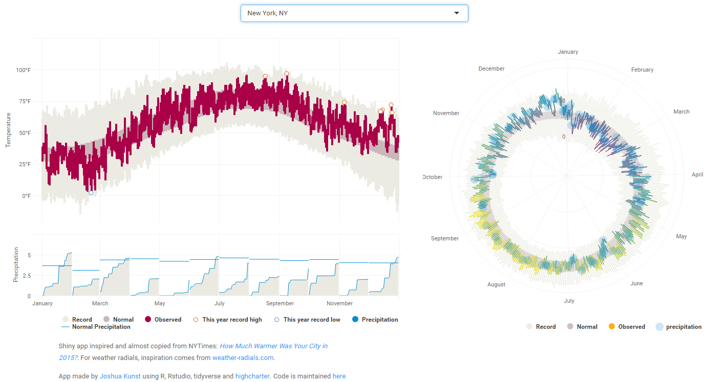

Shiny app inspired and almost copied from NYTimes: 
[_How Much Warmer Was Your City in 2015?_][1]. For weather radials,
inspiration comes from [weather-radials.com][5].

App made by [Joshua Kunst][2] using R, Rstudio, tidyverse and [highcharter][4].
Code is maintained [here][3]
        
[1]: http://www.nytimes.com/interactive/2016/02/19/us/2015-year-in-weather-temperature-precipitation.html
[2]: http://jkunst.com
[3]: https://github.com/jbkunst/shiny-nyt-temp
[4]: http://jkunst.com/highcharter
[5]: http://www.weather-radials.com/

