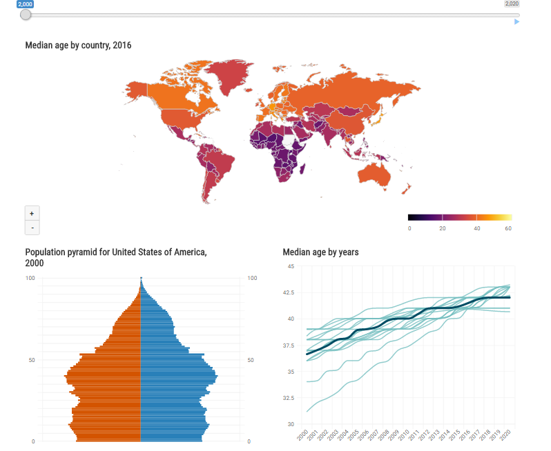

Shiny app inspired from all work by [Kyle Walke][1] by
[Joshua Kunst][2] using R, Rstudio, tidyverse and highcharter.
Code is maintained [here][3]
        
[1]: http://walkerke.github.io/
[2]: http://jkunst.com
[3]: https://github.com/jbkunst/shiny-piramid-census

